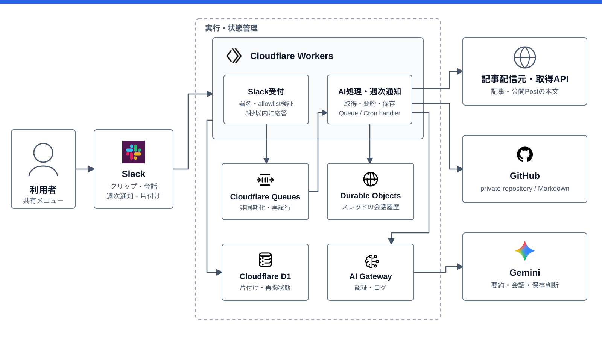

# Reading Clipper

SlackへURLを送るだけで、記事の保存・要約・再発見までをまとめて扱える個人用リーディングクリッパー。



## 概要

Reading Clipperは、アプリやブラウザの共有メニューからSlackへ送ったURLを読み取り、Markdownとしてprivate GitHubリポジトリへ保存するサービス。保存直後にAIが内容を短く要約し、同じSlackスレッドで記事について質問できる。

読まないと決めた記事は、保存直後の返信に付くボタンでその場で片付けられる。片付けていないクリップは毎週Slackへ再掲されるため、保存したまま忘れがちな記事にも自然に戻れる。専用のWeb画面はなく、クリップ、会話、整理の操作がSlackだけで完結する。

## 開発の背景

読みたい技術記事はZenn、X、Qiitaなど複数のプラットフォームに散らばり、それぞれのブックマークへ保存すると一覧性がなくなる。さらに、保存した記事が再び目に入る機会がなく、積読になりがち。

そこで、入口を普段使っているSlackへ一本化し、本文はGitHubへ蓄積、AIによる要約と週次ダイジェストで読むきっかけを作るサービスとして開発。通常のWeb取得では扱いづらいXの公開PostをAPI経由で読めることも、個人用ツールとして重視している。

## 主な機能

- **Slackからすぐにクリップ**
  スマートフォンのアプリやブラウザの共有メニューから、URLをSlack AppのDMへ送るだけで受け付ける。
- **URLに応じた本文取得**
  Qiita、Zenn、Xの公開Post、一般のWebページをそれぞれに適した方法で取得。リダイレクトURLにも対応。
- **紹介投稿から本命の記事を保存**
  Xの短い投稿がブログ記事を紹介している場合、AIが投稿本文を読んだうえでリンク先も取得し、紹介投稿ではなく記事本体をクリップする。
- **要約とスレッド内の質問応答**
  保存時に1〜2文で要約し、続けて質問すると取得済みの本文を踏まえて回答。同じスレッドでは記事を取り直さない。
- **MarkdownをGitHubへ保存**
  記事本文と出典情報をMarkdownへ整え、GitHub App経由で指定したprivateリポジトリへ保存。
- **最近保存したクリップをGitHubで一覧**
  保存先の`clips/README.md`へ最新20件を新しい順で自動表示。まだ片付けていない上位5件はサムネイルと冒頭の抜粋を添えたカードで並べ、それ以前は箇条書きにする。片付けたクリップは取り消し線で消し、見出しには保存総数と残りの件数を出す。タイトルから元の記事へ直接移動でき、記事のファイル名は日付で長くせずタイトルのまま保つ。
- **保存済みクリップを本文から探して読み返す**
  Slackで覚えている語を伝えると、GitHub上の題名・パス・本文から最大5件の候補を探し、選んだMarkdownだけを読んで質問へ答える。D1に記録が無いクリップも検索でき、削除済みの古い検索結果は本文を読む直前の実在確認で止める。
- **その場で、または週次ダイジェストで片付け**
  保存した直後の返信にボタンが付き、読まないと決めた記事をその場で片付けられる。まだ片付けていないクリップは毎週日曜9時（JST）に最大7件Slackへ再掲され、こちらもボタンまたはスレッド内の自然文で片付けられる。GitHub上でMarkdownを直接消したクリップは、投稿の直前に実在を確かめて落とすため、ダイジェストには出てこない。
- **壊れた保存はチャットから削除**
  本文が取れず概要だけが保存されてしまった記事は、Slackで題名やURLの一部を挙げれば消せる。AIが保存済みのクリップを検索して対象を特定し、GitHubのファイルと記録の両方を消す。

## 主な特徴・設計上のポイント

### Slackだけで完結

専用のWeb UIを持たず、保存、要約、記事についての会話、週次通知、片付けまでをSlackへ集約。新しい操作画面を覚えたり、一覧を見に行ったりする必要がない。

### Cloudflare Workersによる軽快な応答

常駐サーバーを持たず、Cloudflare Workers、Queues、Durable Objects、D1を組み合わせている。Workersの短いコールドスタートを活かし、個人利用では無料枠を中心にしながら体感速度を損なわない構成を狙っている。

Slack Events APIへの応答は受付処理だけに限定し、本文取得、AI処理、GitHub保存はQueueへ渡す。時間のかかる処理からSlackの3秒制限を切り離している。

### 用途ごとに状態の置き場所を分離

- 記事本文の正本はprivate GitHubリポジトリに置く
- Slackスレッドごとの会話履歴はDurable Objectsに置く
- 週次ダイジェストの「片付けたか」と表示履歴はD1に置く

D1は厳密な既読・未読管理ではなく、GitHub上のクリップへ付ける軽量な注釈レイヤー。失われてもGitHubのMarkdownから再構成できる。

## システム構成

上の構成図はBot/Core Workerの内部を示す。矢印は主要な連携を表し、完全なリクエスト・レスポンスの時系列ではない。MCP公開境界は下で別に説明する。

Slack受付、Queue処理、週次cronはBot/Core Workerへ同居させ、公開MCP境界だけをMCP Edge Workerへ分離している。AI Gateway経由でGeminiを呼び、記事本文はGitHub、会話履歴とtool refはDurable Objects、ダイジェスト用の状態はD1へ保存する。

構成図の編集元とアイコンの出典は[`docs/architecture/`](docs/architecture/)にある。

### MCP公開

現在のWorkerをBot/Coreとして残し、公開`/mcp`だけを持つMCP Edge Workerを同じrepositoryから別deployする。外部MCP clientはCloudflare Access Managed OAuthで保護したCustom Domainへ接続し、MCP EdgeからCoreへはDNSを通さずService Binding RPCで到達する。通常Botは公開MCPを経由せず、両方の入口が同じCore use caseを呼ぶ。

`load_content` / `save_loaded`と`find_clips` / `read_clip` / `delete_clip`の受け渡しは、owner単位のDurable Objectに置くopaque refを使う。通常BotとMCPで同じtool contractを共有し、会話履歴とrefは90日で削除する。MCP tool callは同期で処理し、既存QueueはSlackの3秒ACKと再試行のためだけに残す。詳細と判断理由は[ADR 0021](docs/adr/0021-publish-tools-through-mcp-edge.md)と[ADR 0022](docs/adr/0022-persist-tool-refs-in-durable-object.md)に記録している。

MCP Edgeは`wrangler.mcp.jsonc`で管理する。Coreを先にdeployした後、EdgeへCustom Domainを手動設定し、そのhostname全体をAccess applicationで保護してManaged OAuthを有効にする。EdgeはCloudflareが検証済みの`ctx.access`からaudienceと本人identityを確認する。必要な実環境値は`ACCESS_AUD`、`ACCESS_ALLOWED_EMAIL`、`MCP_HOSTNAME`で、Coreの業務secretは渡さない。`workers.dev`とpreview URLは無効化している。

`ACCESS_AUD`にはAccess applicationのaudience tag、`ACCESS_ALLOWED_EMAIL`には許可する本人のemail、`MCP_HOSTNAME`にはschemeを含まないCustom Domainのhostnameを設定する。Custom Domain、Access application / policy / Managed OAuth、MCP Edge用のWorkers Builds接続は実環境で手動設定する。

## 技術スタック

| 分類 | 技術 | 役割 |
| --- | --- | --- |
| 言語 | TypeScript | Worker、取得処理、GitHub連携 |
| HTTP / MCP | slack-edge / MCP TypeScript SDK | Slack Events API、Interactivity、Streamable HTTP |
| 実行基盤 | Cloudflare Workers | HTTP受付、Queue consumer、scheduled handler |
| 非同期処理 | Cloudflare Queues | Slack受付と本文取得・AI処理を分離 |
| 会話・tool状態 | Cloudflare Durable Objects | Slackスレッド単位の会話履歴、owner単位のopaque ref、90日Alarm cleanup |
| ダイジェスト状態 | Cloudflare D1 / Cron Triggers | 片付け状態、再掲履歴、週次実行 |
| AI | Vercel AI SDK / Gemini / Cloudflare AI Gateway | 要約、質問応答、保存対象の判断 |
| 本文取得 | Qiita Markdown / Zenn API / X API / Firecrawl | URLごとの本文取得 |
| 保存 | GitHub App / Contents API | privateリポジトリへのMarkdown保存 |
| テスト | Vitest / Cloudflare Workers test pool | Worker環境でのユニットテスト |

## セットアップ

### 前提

- Node.js 22
- `package.json`で固定されたpnpm
- Socket Firewall（依存関係の取得時に使用）
- Cloudflare、Slack App、GitHub App、Gemini API、Firecrawl、X APIの各アカウント

### ローカル開発

```powershell
sfw pnpm install
pnpm wrangler d1 execute reading-clipper-clips-db --local --file=./schema.sql
pnpm dev
```

Slack連携を含めて動かすには、`wrangler.jsonc`に定義されたQueue、Durable Objects、D1、Cron Triggers、AI Gatewayと、次のWorker Secretsが必要。最新の一覧と用途は[`src/types.ts`](src/types.ts)の`Env`を参照。

```text
CLOUDFLARE_ACCOUNT_ID
SLACK_SIGNING_SECRET
SLACK_BOT_TOKEN
SLACK_ALLOWED_TEAM_ID
SLACK_ALLOWED_USER_ID
AI_GATEWAY_TOKEN
GITHUB_APP_ID
GITHUB_APP_PRIVATE_KEY
GITHUB_INSTALLATION_ID
GITHUB_REPO
FIRECRAWL_API_KEY
X_BEARER_TOKEN
```

Secretは個別に登録。

```powershell
pnpm wrangler secret put <NAME>
```

AI Gatewayの作成・更新には、`AI Gateway Read`と`AI Gateway Write`権限を持つCloudflare API tokenを環境変数へ設定し、次を実行。

```powershell
pnpm setup:aigw
```

Slack AppはDMの`message.im`をEvents APIで受信し、Interactivityで片付けのボタンを処理する。Request URLは両方とも`/slack/events`（[ADR 0014](docs/adr/0014-slack-edge-for-the-boundary.md)）。GitHub Appには保存先リポジトリだけを対象とした`Contents: Read and write`権限を与える。

### 検証

```powershell
pnpm test
pnpm typecheck
pnpm dry-run
```

## 制約

- 単一のSlackワークスペースとユーザーをallowlistで許可する個人利用向け。
- XはAPIから取得できる公開Postだけを対象とし、protected contentは保存しない。
- 週次ダイジェストは「読んだか」ではなく「片付けたか」だけを管理。
- 保存先はprivate GitHubリポジトリを前提とし、取得した本文を外部へ再配布しない。
- 削除は既定ブランチの先頭からファイルを消すだけで、本文はGitの履歴に残る。取り消しは`git revert`で行う。

## 設計判断

主要な設計判断と代替案は[`docs/adr/`](docs/adr/)に記録。

- [Slackの入力をすべてAIへ渡し、保存をツールにする](docs/adr/0006-agent-with-save-tool.md)
- [スレッドの会話履歴をDurable Objectsに保存する](docs/adr/0007-thread-history-in-durable-object.md)
- [週次ダイジェストと片付け状態をD1で管理する](docs/adr/0010-weekly-digest-and-dismiss-bit.md)
- [本文を読んでからAIが保存対象を決める](docs/adr/0012-load-content-then-save-loaded.md)
- [クリップ直後の返信にDismissボタンを出す](docs/adr/0015-dismiss-button-on-the-clip-reply.md)
- [クリップの削除を検索とターン内の参照番号で組む](docs/adr/0016-delete-clip-via-search-and-turn-scoped-ref.md)
- [フラットな保存構造と新着順の表示を分離する](docs/adr/0017-generated-recent-clip-index.md)
- [GitHubから消えたクリップは出す直前の実在確認で落とす](docs/adr/0018-verify-clip-exists-before-digest.md)
- [保存済みクリップはGitHubで検索し、現在の本文を読み直す](docs/adr/0020-search-and-read-saved-clips-via-github.md)
- [MCP公開境界を専用Workerへ分離し、Access Managed OAuthで保護する](docs/adr/0021-publish-tools-through-mcp-edge.md)
- [ツール参照をDurable Objectへ90日保持し、BotとMCPで共通化する](docs/adr/0022-persist-tool-refs-in-durable-object.md)
- [新着一覧をカードと箇条書きに分け、片付けを表示に出す](docs/adr/0023-clip-index-cards-and-dismissed-marks.md)
